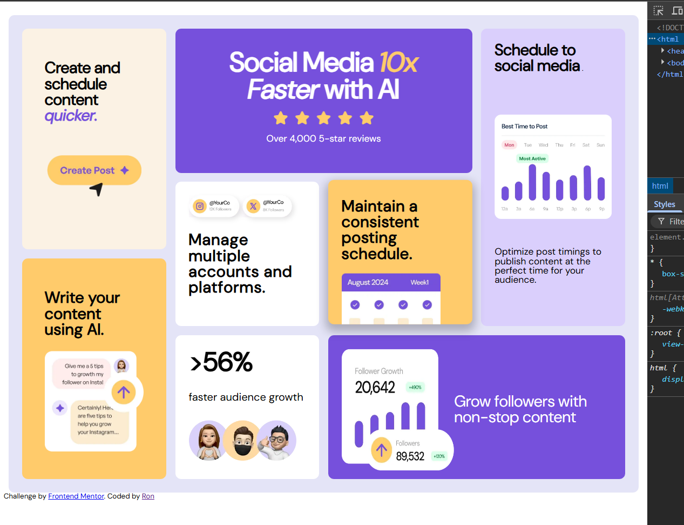

# Frontend Mentor - Bento grid solution

This is a solution to the [Bento grid challenge on Frontend Mentor](https://www.frontendmentor.io/challenges/bento-grid-RMydElrlOj). Frontend Mentor challenges help you improve your coding skills by building realistic projects. 

## Table of contents

- [Overview](#overview)
  - [The challenge](#the-challenge)
  - [Screenshot](#screenshot)
  - [Links](#links)
- [My process](#my-process)
  - [Built with](#built-with)
  - [What I learned](#what-i-learned)
  - [Continued development](#continued-development)
  - [Useful resources](#useful-resources)


## Overview

### The challenge

Users should be able to:

- View the optimal layout for the interface depending on their device's screen size

### Screenshot




### Links

- Solution URL: [Add solution URL here](https://github.com/Chimunor-Nwibe/bento-grid-main)
- Live Site URL: [Add live site URL here](https://your-live-site-url.com)

## My process

### Built with

- Semantic HTML5 markup
- CSS custom properties
- Flexbox
- CSS Grid
### What I learned

I learnt the use of effective media query, use of alt in images, basic concept of the use of css grids and reponsive and accessible design.


```html
 <div class="item growth"> <h2>>56%</h2><br>
     <span class="growth-txt">faster audience growth</span> <br>
      
  </div>
```
```css
@media (max-width: 768px) {
  .grid-container {
    height: auto;

    grid-template-columns: 1fr;

    grid-template-areas:
      "hero"
      "aside2"
      "aside3"
      "aside4"
      "aside5"
      "aside6"
      "aside7"
      "aside8"; width: 100%;
}
}

.item {
    border-radius: 13px; border: solid black,0.2 ;overflow: hidden; display: block; transition: transition 0.3s ease-in-out; transition: box-shadow 0.3s ease-in-out}

.item:hover {transform: scale(1.1); z-index: 5; box-shadow: 0px 10px 20px 5px rgba(0, 0, 0, 0.25); transform: translateY(-4px); }  
```


If you want more help with writing markdown, we'd recommend checking out [The Markdown Guide](https://www.markdownguide.org/) to learn more.


### Continued development

I would like to continue learning and focus on these more css grid, flexbox and css transitions


### Useful resources

- [Example resource 1](https://www.freecodecamp.org/news/bento-grids-in-web-design/) - This heped understand how bento grids are arranged.


## Author

- Frontend Mentor - [@@Chimunor-Nwibe](https://www.frontendmentor.io/profile/Chimunor-Nwibe)


**Note: Delete this note and add/remove/edit lines above based on what links you'd like to share.**


